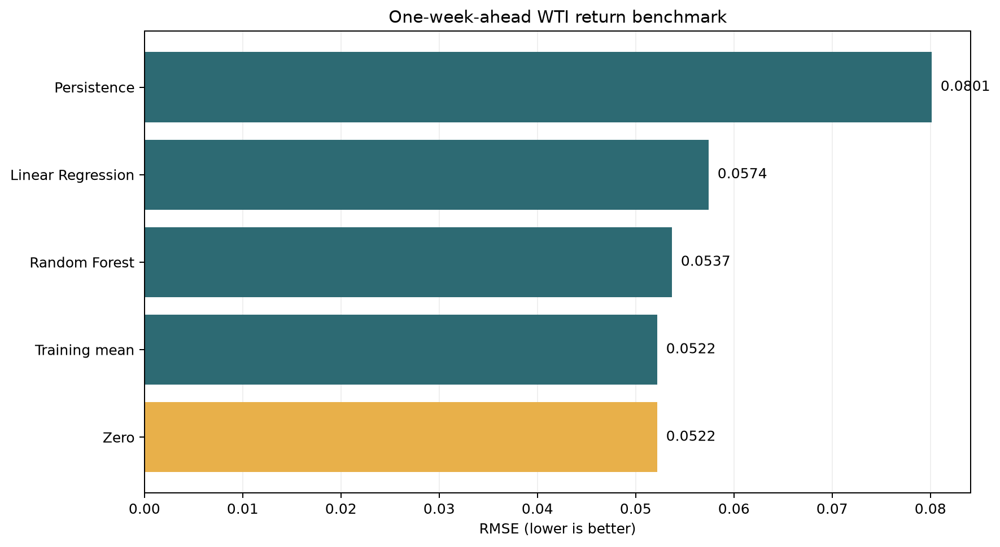
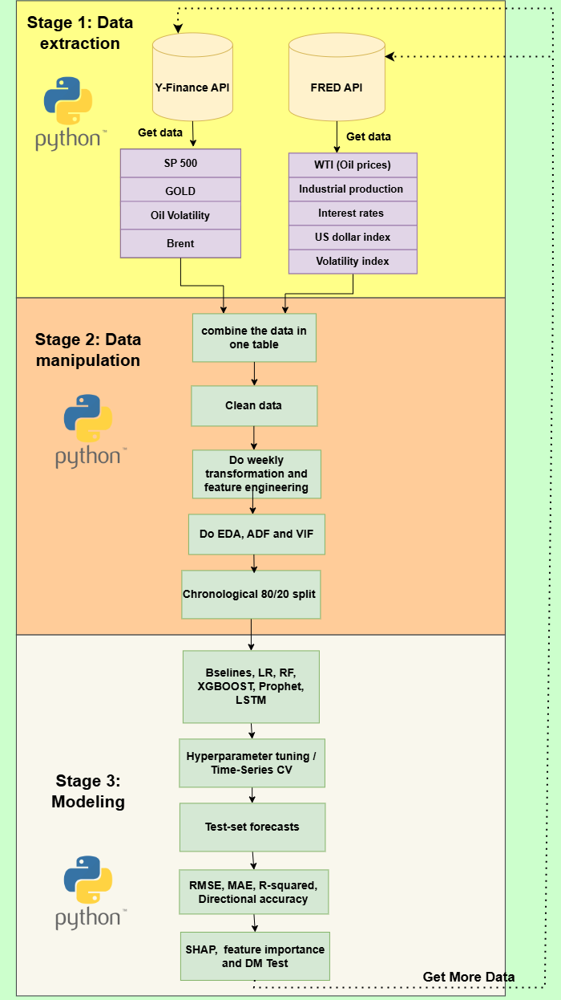

# Forecasting WTI returns with machine learning

> A reproducible time-series study of whether macro-financial signals improve one-week-ahead
> forecasts of West Texas Intermediate crude-oil returns.

[](https://github.com/Carlson29/Crude-Oil-Prices-Model/actions/workflows/quality.yml)


This repository combines the original 169-cell research notebook with a compact, testable companion
pipeline. The notebook preserves the full investigation—baselines, Linear Regression, Random Forest,
XGBoost, Prophet, sequence LSTM, SHAP, regime analysis and directional classification—while the
companion package gives reviewers a one-command benchmark, automated leakage checks, CI and an
interactive evidence dashboard.

## Why this project matters

Short-horizon financial returns are difficult to forecast and easy to evaluate incorrectly. This
project therefore treats strong baselines, chronological validation and negative results as first-
class evidence. It asks:

1. Can macro-financial indicators improve one-week-ahead WTI-return forecasts?
2. Do fitted models beat zero, training-mean and persistence baselines?
3. Which variables influence nonlinear forecasts?
4. Are forecast-loss differences statistically meaningful?

## Reproducible benchmark result

The committed companion benchmark uses 773 weekly observations, 19 predictors and an 80/20
chronological split. The held-out period starts on 14 January 2022.

| Model | RMSE ↓ | MAE ↓ | R² ↑ | Directional accuracy ↑ |
| --- | ---: | ---: | ---: | ---: |
| **Zero** | **0.0522** | 0.0395 | -0.000 | 47.1% |
| Training mean | 0.0522 | **0.0395** | -0.000 | **52.9%** |
| Random Forest | 0.0537 | 0.0410 | -0.059 | 41.9% |
| Linear Regression | 0.0574 | 0.0438 | -0.211 | 51.6% |
| Persistence | 0.0801 | 0.0615 | -1.359 | 47.1% |



**Finding:** the zero-return baseline has the lowest held-out RMSE. The fitted models do not beat
that difficult baseline in the compact benchmark. This is a useful negative result: complexity alone
does not create forecasting skill. The broader notebook retains the Prophet, XGBoost, LSTM, SHAP,
classification and regime experiments for deeper analysis.

Read the complete assumptions and limitations in the [model card](MODEL_CARD.md).

## What the repository demonstrates

- Time-aware feature engineering using returns, differences, lags and rolling statistics.
- Comparison against zero, training-mean and persistence baselines.
- Chronological splitting and time-series validation without random shuffling.
- Linear, ensemble, boosting, additive and sequence-model experiments.
- RMSE, MAE, R², directional accuracy and Diebold–Mariano testing.
- SHAP and feature-importance analysis for nonlinear models.
- Automated target-alignment and leakage-regression tests.
- Reusable Python modules, CI and a Streamlit evidence dashboard.

## Data

The study covers March 2010 through December 2024. The model-ready weekly dataset contains 773 rows.
The original daily extraction contains approximately 3,957 observations.

| Signal | Source | Role |
| --- | --- | --- |
| WTI spot price | FRED `DCOILWTICO` | Target history |
| S&P 500 | Yahoo Finance `^GSPC` | Equity-market conditions |
| VIX | FRED `VIXCLS` | Broad market volatility |
| US dollar | FRED `DTWEXBGS` | Currency conditions |
| Gold | Yahoo Finance `GC=F` | Alternative safe-haven asset |
| Treasury yields | FRED `DGS3`, `DGS10` | Yield-spread conditions |
| Oil volatility | Yahoo Finance `^OVX` | Oil-market uncertainty |
| Brent | FRED `DCOILBRENTEU` | Global oil benchmark |
| Industrial production | FRED `INDPRO` | Macroeconomic activity |

The processed CSV is committed so the benchmark and dashboard work without network access or API
credentials.

## Architecture



```text
Committed weekly data
        │
        ├── Original notebook ── full research, outputs and rendered HTML
        │
        └── Companion package
              ├── schema and target-alignment checks
              ├── chronological 80/20 split
              ├── baselines and fitted models
              ├── metrics and Diebold–Mariano comparison
              ├── CSV / JSON / chart evidence
              └── Streamlit dashboard + CI tests
```

## Quick start

Use Python 3.11 or 3.12.

```bash
git clone https://github.com/Carlson29/Crude-Oil-Prices-Model.git
cd Crude-Oil-Prices-Model
python -m venv .venv
```

Activate the environment:

```powershell
.venv\Scripts\Activate.ps1
```

```bash
# macOS / Linux
source .venv/bin/activate
```

Install the reproducible companion environment:

```bash
python -m pip install -r requirements-companion.txt
python -m pip install -e .
```

Run the benchmark and tests:

```bash
python scripts/run_benchmark.py
pytest
ruff check app.py scripts src tests
```

Open the evidence dashboard:

```bash
streamlit run app.py
```

The dashboard reads committed data and generated evidence; it does not make financial predictions or
require an API key.

## Run the full original study

The original notebook is retained with its analysis intact; only credential loading was secured.
The rendered HTML remains available as a reference:

- [`code Files/oil_prediction.ipynb`](code%20Files/oil_prediction.ipynb)
- [`code Files/oil_prediction.html`](code%20Files/oil_prediction.html)

Install the broader research dependencies:

```bash
python -m pip install -r requirements.txt
jupyter notebook "code Files/oil_prediction.ipynb"
```

To refresh FRED source data, set the environment variable directly. The included `.env.example`
documents the required variable name:

```powershell
$env:FRED_API_KEY="your-own-key"
```

```bash
export FRED_API_KEY="your-own-key"
```

Never commit the key. The committed datasets allow the analysis and companion benchmark to be
reviewed without it.

## Repository map

```text
.
├── app.py                         # Interactive evidence dashboard
├── code Files/
│   ├── oil_prediction.ipynb       # Complete original research
│   └── oil_prediction.html        # Rendered notebook with saved outputs
├── data/
│   ├── model_data/model_data.csv  # Weekly modelling table
│   └── raw_data/wti_data.csv      # Extracted daily source data
├── documentation/flowchart.png
├── outputs/                       # Original study figures
├── results/                       # Reproducible companion evidence
├── scripts/run_benchmark.py
├── src/wti_forecasting/           # Validated reusable package
├── tests/                         # Data, leakage, metric and security contracts
├── MODEL_CARD.md
└── pyproject.toml
```

## Limitations

- This is a research prototype, not a trading system or financial advice.
- Economic series can be revised after initial publication; the committed data is not a full
  real-time vintage database.
- Results depend on the sample period and may change across market regimes.
- The compact CI benchmark deliberately excludes computationally expensive Prophet and LSTM runs;
  those remain documented in the original notebook.
- Negative held-out R² values show that predicting weekly returns remains difficult and that model
  complexity must not be confused with out-of-sample value.

## CV summary

> Developed an end-to-end WTI-return forecasting study using macro-financial indicators, comparing
> statistical, ensemble, boosting and sequence models against naïve baselines under chronological
> validation. Added leakage tests, Diebold–Mariano comparisons, explainability, reproducible benchmark
> artefacts, CI and an interactive evidence dashboard.
